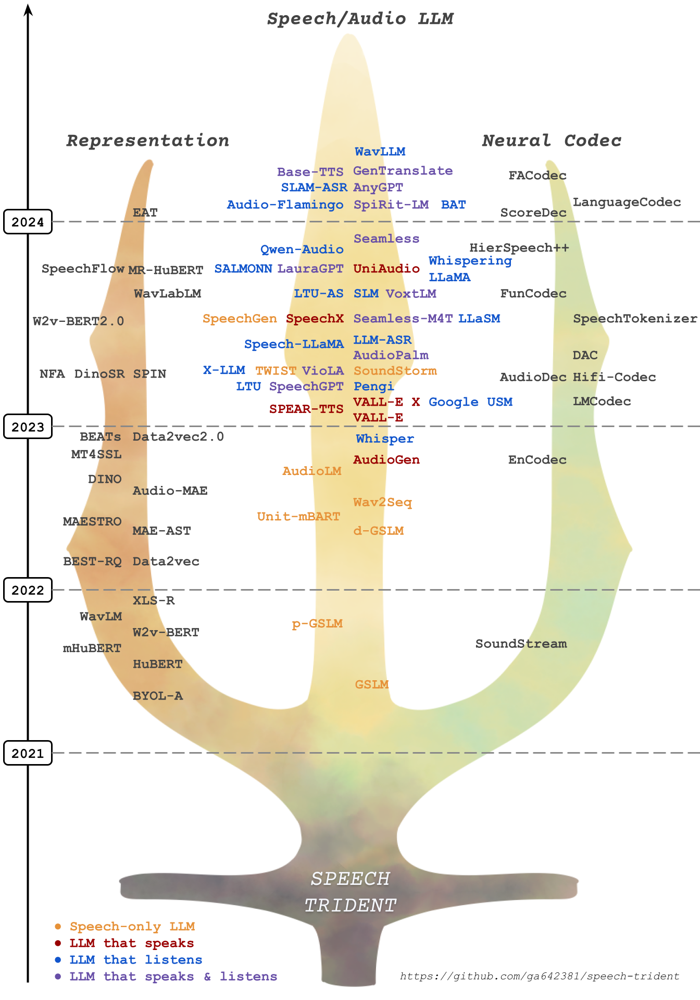

# :trident: Speech Trident - Awesome Speech LM

<p align="center">
  
</p>

In this repository, we survey three crucial areas: (1) representation learning, (2) neural codec, and (3) language models that contribute to speech/audio large language models.

1.⚡ **Speech Representation Models:** These models focus on learning structural speech representations, which can then be quantized into discrete speech tokens, often refer to **semantic tokens**.

2.⚡ **Speech Neural Codec Models:** These models are designed to learn speech and audio discrete tokens, often referred to as **acoustic tokens**, while maintaining reconstruction ability and low bitrate.

3.⚡ **Speech Large Language Models:** These models are trained on top of speech and acoustic tokens in a language modeling approach. They demonstrate proficiency in tasks on speech understanding and speech generation.

## :trident: Contributors

<table>
  <tr>
    <td align="center">
      <a href="https://kwchang.org/">
        
        <br />
        <sub><b>Kai-Wei Chang</b></sub>
      </a>
    </td>
    <td align="center">
      <a href="https://hbwu-ntu.github.io/">
        
        <br />
        <sub><b>Haibin Wu</b></sub>
      </a>
    </td>
      <td align="center">
      <a href="https://scholar.google.com.tw/citations?user=-d6aNP0AAAAJ&hl=zh-TW">
        
        <br />
        <sub><b>Wei-Cheng Tseng</b></sub>
      </a>
    </td>
  </tr>
  <tr>
    <td align="center">
      <a href="https://kehanlu.com/">
        
        <br />
        <sub><b>Kehan Lu</b></sub>
      </a>
    </td>
    <td align="center">
      <a href="https://github.com/kuan2jiu99">
        
        <br />
        <sub><b>Chun-Yi Kuan</b></sub>
      </a>
    </td>
    <td align="center">
      <a href="https://speech.ee.ntu.edu.tw/~hylee/index.php">
        
        <br />
        <sub><b>Hung-yi Lee</b></sub>
      </a>
    </td>
  </tr>
</table>

## :trident: News
### [Codec-SUPERB @ SLT 2024](https://codecsuperb.github.io/)
- The challenge covers nowday's neural audio codecs and speech / audio language models.
  - Time: December 3 starting at 15:15
  - Detailed agenda: https://codecsuperb.github.io/
- Keynote speakers
  - [Neil Zeghidour (Kyutai)](https://scholar.google.com/citations?user=fiJamZ0AAAAJ&hl=fr): 15:15-16:00
    - [Slides](https://drive.google.com/file/d/1SrDLQ_XMetVS7Xfo72blVtGYvjNxWwRP/view?usp=sharing) | [Recording](https://drive.google.com/file/d/1_UAwzqfFfU3CLz-4p7V3k-c8wt7osba5/view?usp=drive_link) | [YouTube](https://www.youtube.com/watch?v=Zjpl84KCTvw&list=PLJV_el3uVTsNnC37JYD8kBcNDI7CNJgum) | [Bilibili](https://www.bilibili.com/video/BV115qZYuENj/?spm_id_from=333.999.0.0&vd_source=de7baff5ae97e3392cfbc4c86ea52abf)
    - Title: Audio Language Models
  - [Dongchao Yang (CUHK)](https://scholar.google.com/citations?user=WNiojyAAAAAJ&hl=zh-CN): 16:00-16:35
    - [Slides](https://drive.google.com/file/d/1oXArl4DayOraVzVH0INUsnB8toIfEJiM/view?usp=sharing) | [Recording](https://drive.google.com/file/d/1owL-lA_VH2rujvG93DaVV1upo8JSrWRc/view?usp=drive_link) | [YouTube](https://www.youtube.com/watch?v=ExDfqz8NfnE&list=PLJV_el3uVTsNnC37JYD8kBcNDI7CNJgum&index=3) | [Bilibili](https://www.bilibili.com/video/BV1m3qZY3Ej3/?spm_id_from=333.999.0.0&vd_source=de7baff5ae97e3392cfbc4c86ea52abf)
    - Title: Challenges in Developing Universal Audio Foundation Model
  - [Shang-Wen Li (Meta)](https://swdanielli.github.io/): 16:35-17:10
    - [Slides](https://drive.google.com/file/d/1aRGllscyT2QMRA0sBtebHpBNiDfN84Wq/view?usp=sharing) | [Recording](https://drive.google.com/file/d/1epVNVNoqiHkS3_KPXnCE4f8KZWTcmea1/view?usp=drive_link) | [YouTube](https://www.youtube.com/watch?v=JidtdZVtpkI&list=PLJV_el3uVTsNnC37JYD8kBcNDI7CNJgum&index=2) | [Bilibili](https://www.bilibili.com/video/BV1R9qoYXEWJ/?spm_id_from=333.999.0.0)
    - Title: VoiceCraft: Zero-Shot Speech Editing and TTS in the Wild
  - [Wenwu Wang (University of Surrey)](https://scholar.google.co.uk/citations?user=JQFnV5IAAAAJ&hl=en): 17:40-18:15
    - [Slides](https://drive.google.com/file/d/1gjBHCi76JiQmaSs9at8T1h2Aw2SnmH08/view?usp=sharing) | [Recording](https://drive.google.com/file/d/1bb3WBHI9z1yOWaTUKn5xKmppe0EHeFyk/view?usp=drive_link) | [YouTube](https://www.youtube.com/watch?v=fIoCxwVobEo&list=PLJV_el3uVTsNnC37JYD8kBcNDI7CNJgum&index=4) | [Bilibili](https://www.bilibili.com/video/BV1dXqoYWE6L/?spm_id_from=333.999.0.0&vd_source=de7baff5ae97e3392cfbc4c86ea52abf)
    - Title: Neural Audio Codecs: Recent Progress and a Case Study with SemantiCodec
  - [Minje Kim (UIUC)](https://siebelschool.illinois.edu/about/people/all-faculty/minje): 18:15-18:50
    - [Slides](https://drive.google.com/file/d/1NsWFRC0-d86tgk-Z36D8oRocT4nX_9FQ/view?usp=sharing) | [Recording](https://drive.google.com/file/d/16wH7nixp_botp1vJAeeQM9ucsnpaRlZ0/view?usp=drive_link) | [YouTube](https://www.youtube.com/watch?v=zxFTrb_xGD0&list=PLJV_el3uVTsNnC37JYD8kBcNDI7CNJgum&index=5) | [Bilibili](https://www.bilibili.com/video/BV1GfqoYnEfS/?spm_id_from=333.999.0.0&vd_source=de7baff5ae97e3392cfbc4c86ea52abf)
    - Title: Future Directions in Neural Speech Communication Codecs
- Host
  - [Hung-yi Lee (NTU)](https://speech.ee.ntu.edu.tw/~hylee/index.php)
  - [Haibin Wu (Microsoft)](https://hbwu-ntu.github.io)
- Accepted papers ([Recording](https://drive.google.com/file/d/1NH0RyqZJ8NogH5jUuO5tQ9iShKj95WeM/view?usp=drive_link))
  - ESPnet-Codec: Comprehensive Training and Evaluation of Neural Codecs for Audio, Music, and Speech
  - Codec-SUPERB @ SLT 2024: A lightweight benchmark for neural audio codec models
  - Investigating neural audio codecs for speech language model-based speech generation
  - Addressing Index Collapse of Large-Codebook Speech Tokenizer with Dual-Decoding Product-Quantized Variational Auto-Encoder
  - MDCTCodec: A Lightweight MDCT-based Neural Audio Codec towards High Sampling Rate and Low Bitrate Scenarios

## :trident: Speech/Audio Language Models

| Date    | Model Name     | Paper Title                                                                                                           | Link                                      |
| ------- | -------------- | --------------------------------------------------------------------------------------------------------------------- | ----------------------------------------- |
| 2025-04 | -   | On The Landscape of Spoken Language Models: A Comprehensive Survey | [Paper](https://arxiv.org/pdf/2504.08528) |
| 2025-03 | Qwen2.5-Omni   | Qwen2.5-Omni Technical Report | [Paper](https://arxiv.org/abs/2503.20215) |
| 2025-03 | Yue   | YuE: Scaling Open Foundation Models for Long-Form Music Generation | [Paper](https://arxiv.org/pdf/2503.08638) |
| 2025-03 | CSM   | Conversational speech generation | [blog](https://www.sesame.com/research/crossing_the_uncanny_valley_of_voice#demo) |
| 2025-03 | Phi-4-Multimodal   | Phi-4-Mini Technical Report: compact yet powerful multimodal language models via mixture-of-LoRAs | [paper](https://arxiv.org/abs/2503.01743) |
| 2025-03 | Baichuan-Audio   | Baichuan-Audio: A Unified Framework for End-to-End Speech Interaction | [paper](https://arxiv.org/pdf/2502.17239) |
| 2025-02 | Slamming   | Slamming: Training a Speech Language Model on One GPU in a Day | [paper](https://arxiv.org/pdf/2502.15814) |
| 2025-02 | Step-Audio   | Step-Audio: Unified Understanding and Generation in Intelligent Speech Interaction | [paper](https://github.com/stepfun-ai/Step-Audio/blob/cn-readme/assets/Step-Audio.pdf) |
| 2025-01 | BAICHUAN-OMNI-1.5   | BAICHUAN-OMNI-1.5 TECHNICAL REPORT | [paper](https://arxiv.org/pdf/2501.15368) |
| 2025-01 |  MiniCPM-o   | A GPT-4o Level MLLM for Vision, Speech and Multimodal Live Streaming on Your Phone | [GitHub](https://github.com/OpenBMB/MiniCPM-o) |
| 2025-01 |  MinMo   | MinMo: A Multimodal large Language Model for Seamless Voice Interaction | [Paper](https://funaudiollm.github.io/minmo/) |
| 2025-01 |  VITA-1.5   | VITA-1.5: Towards GPT-4o Level Real-Time Vision and Speech Interaction | [Paper](https://arxiv.org/html/2501.01957v1) |
| 2025-01 |  OMNICHAT   | OmniChat: Enhancing Spoken Dialogue Systems with Scalable Synthetic Data for Diverse Scenarios | [Paper](https://arxiv.org/abs/2501.01384) |
| 2025-01 |  SLIDE   | SLIDE: Integrating Speech Language Model with LLM for Spontaneous Spoken Dialogue Generation | [Paper](https://arxiv.org/pdf/2501.00805) |
| 2024-12 | SLAM-Omni   | SLAM-Omni: Timbre-Controllable Voice Interaction System with Single-Stage Training | [paper](https://arxiv.org/abs/2412.15649), [code](https://github.com/X-LANCE/SLAM-LLM/blob/main/examples/s2s/README.md) |
| 2024-12 |   TouchTTS  | TouchTTS: An Embarrassingly Simple TTS Framework that Everyone Can Touch | [Paper](https://www.arxiv.org/abs/2412.08237) |
| 2024-12 |   CosyVoice 2  | CosyVoice 2: Scalable Streaming Speech Synthesis with Large Language Models | [Paper](https://arxiv.org/pdf/2412.10117) |
| 2024-12 |   GLM-4-Voice  | GLM-4-Voice: Towards Intelligent and Human-Like End-to-End Spoken Chatbot | [Paper](https://arxiv.org/pdf/2412.02612) |
| 2024-12 |   AlignFormer  | AlignFormer: Modality Matching Can Achieve Better Zero-shot Instruction-Following Speech-LLM | [Paper](https://arxiv.org/pdf/2412.01145) |
| 2024-11 |   --  | Scaling Speech-Text Pre-training with Synthetic Interleaved Data | [Paper](https://arxiv.org/abs/2411.17607) |
| 2024-11 |   --  | State-Space Large Audio Language Models | [Paper](https://arxiv.org/pdf/2411.15685) |
| 2024-11 |   --  | Building a Taiwanese Mandarin Spoken Language Model: A First Attempt | [Paper](https://arxiv.org/abs/2411.07111) |
| 2024-11 | Ultravox    | Ultravox: An open-weight alternative to GPT-4o Realtime | [Blog](https://www.ultravox.ai/blog/ultravox-an-open-weight-alternative-to-gpt-4o-realtime) |
| 2024-11 | hertz-dev    | [blog](https://si.inc/hertz-dev/)  | [GitHub](https://github.com/Standard-Intelligence/hertz-dev) |
| 2024-11 | Freeze-Omni    |  Freeze-Omni: A Smart and Low Latency Speech-to-speech Dialogue Model with Frozen LLM | [paper](https://arxiv.org/abs/2411.00774) |
| 2024-11 | Align-SLM              | Align-SLM: Textless Spoken Language Models with Reinforcement Learning from AI Feedback       | [paper](https://arxiv.org/pdf/2411.01834) |
| 2024-10 | Ichigo | Ichigo: Mixed-Modal Early-Fusion Realtime Voice Assistant | [paper](https://arxiv.org/abs/2410.15316), [code](https://github.com/homebrewltd/ichigo)|
| 2024-10 | OmniFlatten              | OmniFlatten: An End-to-end GPT Model for Seamless Voice Conversation       | [paper](https://arxiv.org/abs/2410.17799v1) |
| 2024-10 | GPT-4o              | GPT-4o System Card       | [paper](https://arxiv.org/pdf/2410.21276) |
| 2024-10 | Baichuan-OMNI              | Baichuan-Omni Technical Report       | [paper](https://arxiv.org/abs/2410.08565) |
| 2024-10 | GLM-4-Voice                | GLM-4-Voice       | [GitHub](https://github.com/THUDM/GLM-4-Voice) |
| 2024-10 | --              | Roadmap towards Superhuman Speech Understanding using Large Language Models       | [paper](https://arxiv.org/abs/2410.13268) |
| 2024-10 | SALMONN-OMNI               | SALMONN-OMNI: A SPEECH UNDERSTANDING AND GENERATION LLM IN A CODEC-FREE FULL-DUPLEX FRAMEWORK       | [paper](https://openreview.net/attachment?id=eJpI20hzWf&name=pdf) |
| 2024-10 | Mini-Omni 2               | Mini-Omni2: Towards Open-source GPT-4o with Vision, Speech and Duplex Capabilities       | [paper](https://arxiv.org/abs/2410.11190) |
| 2024-10 | HALL-E               | HALL-E: Hierarchical Neural Codec Language Model for Minute-Long Zero-Shot Text-to-Speech Synthesis       | [paper](https://openreview.net/forum?id=868masI331) |
| 2024-10 | SyllableLM    |  SyllableLM: Learning Coarse Semantic Units for Speech Language Models     | [paper](https://arxiv.org/html/2410.04029v1) |
| 2024-09 | Moshi               | Moshi: a speech-text foundation model for real-time dialogue       | [paper](https://kyutai.org/Moshi.pdf) |
| 2024-09 | Takin AudioLLM           | Takin: A Cohort of Superior Quality Zero-shot Speech Generation Models       | [paper](https://arxiv.org/abs/2409.12139) |
| 2024-09 | FireRedTTS          | FireRedTTS: A Foundation Text-To-Speech Framework for Industry-Level Generative Speech Applications       | [paper](https://arxiv.org/html/2409.03283v1) |
| 2024-09 | LLaMA-Omni         | LLaMA-Omni: Seamless Speech Interaction with Large Language Models                                                      | [paper](https://arxiv.org/abs/2409.06666) |
| 2024-09 | MaskGCT         | MaskGCT: Zero-Shot Text-to-Speech with Masked Generative Codec Transformer                                                       | [paper](https://arxiv.org/abs/2409.00750v1) |
| 2024-09 | SSR-Speech         | SSR-Speech: Towards Stable, Safe and Robust Zero-shot Text-based Speech Editing and Synthesis                                                       | [paper](https://arxiv.org/abs/2409.07556) |
| 2024-09 | MoWE-Audio         | MoWE-Audio: Multitask AudioLLMs with Mixture of Weak Encoders                                                       | [paper](https://arxiv.org/pdf/2409.06635) |
| 2024-08 | Mini-Omni       | Mini-Omni: Language Models Can Hear, Talk While Thinking in Streaming                                       | [paper](https://arxiv.org/abs/2408.16725) |
| 2024-08 | Make-A-Voice 2       |  Make-A-Voice: Revisiting Voice Large Language Models as Scalable Multilingual and Multitask Learner    | [paper](https://aclanthology.org/2024.acl-long.589/) |
| 2024-08 | LSLM       |  Language Model Can Listen While Speaking  | [paper](https://arxiv.org/abs/2408.02622) |
| 2024-07 | Seed-ASR       |  Seed-ASR: Understanding Diverse Speech and Contexts with LLM-based Speech Recognition  | [paper](https://arxiv.org/abs/2407.04675) |
| 2024-06 | SimpleSpeech       | SimpleSpeech: Towards Simple and Efficient Text-to-Speech with Scalar Latent Transformer Diffusion Models                                       | [paper](https://arxiv.org/abs/2406.02328) |
| 2024-06 | UniAudio 1.5                | UniAudio 1.5: Large Language Model-driven Audio Codec is A Few-shot Audio Task Learner  | [paper](https://arxiv.org/abs/2406.10056) |
| 2024-06 | VALL-E R               | VALL-E R: Robust and Efficient Zero-Shot Text-to-Speech Synthesis via Monotonic Alignment  | [paper](https://arxiv.org/abs/2406.07855) |
| 2024-06 | VALL-E 2               | VALL-E 2: Neural Codec Language Models are Human Parity Zero-Shot Text to Speech Synthesizers  | [paper](https://arxiv.org/abs/2406.05370) |
| 2024-06 | GPST             | Generative Pre-trained Speech Language Model with Efficient Hierarchical Transformer  | [paper](https://arxiv.org/abs/2406.00976) |
| 2024-04 | CLaM-TTS         | CLaM-TTS: Improving Neural Codec Language Model for Zero-Shot Text-to-Speech                                                       | [paper](https://arxiv.org/abs/2404.02781) |
| 2024-04 | RALL-E         | RALL-E: Robust Codec Language Modeling with Chain-of-Thought Prompting for Text-to-Speech Synthesis                                                       | [paper](https://arxiv.org/abs/2404.03204) |
| 2024-04 | WavLLM         | WavLLM: Towards Robust and Adaptive Speech Large Language Model                                                       | [paper](https://arxiv.org/abs/2404.00656) |
| 2024-02 | MobileSpeech       | MobileSpeech: A Fast and High-Fidelity Framework for Mobile Zero-Shot Text-to-Speech                                                    | [paper](https://arxiv.org/abs/2402.09378) |
| 2024-02 | SLAM-ASR       | An Embarrassingly Simple Approach for LLM with Strong ASR Capacity                                                    | [paper](https://arxiv.org/abs/2402.08846) |
| 2024-02 | AnyGPT         | AnyGPT: Unified Multimodal LLM with Discrete Sequence Modeling                                                        | [paper](https://arxiv.org/abs/2402.12226) |
| 2024-02 | SpiRit-LM      | SpiRit-LM: Interleaved Spoken and Written Language Model                                                              | [paper](https://arxiv.org/abs/2402.05755) |
| 2024-02 | USDM           | Integrating Paralinguistics in Speech-Empowered Large Language Models for Natural Conversation                                                       | [paper](https://arxiv.org/abs/2402.05706) |
| 2024-02 | BAT            | BAT: Learning to Reason about Spatial Sounds with Large Language Models                                               | [paper](https://arxiv.org/abs/2402.01591) |
| 2024-02 | Audio Flamingo | Audio Flamingo: A Novel Audio Language Model with Few-Shot Learning and Dialogue Abilities                            | [paper](https://arxiv.org/abs/2402.01831) |
| 2024-02 | Text Description to speech | Natural language guidance of high-fidelity text-to-speech with synthetic annotations                      | [paper](https://arxiv.org/abs/2402.01912) |
| 2024-02 | GenTranslate   | GenTranslate: Large Language Models are Generative Multilingual Speech and Machine Translators                        | [paper](https://arxiv.org/abs/2402.06894) |
| 2024-02 | Base-TTS       | BASE TTS: Lessons from building a billion-parameter Text-to-Speech model on 100K hours of data                        | [paper](https://arxiv.org/abs/2402.08093) |
| 2024-02 | --             | It's Never Too Late: Fusing Acoustic Information into Large Language Models for Automatic Speech Recognition          | [paper](https://arxiv.org/abs/2402.05457) |
| 2024-01 | --             | Large Language Models are Efficient Learners of Noise-Robust Speech Recognition                                       | [paper](https://arxiv.org/abs/2401.10446) |
| 2024-01 | ELLA-V             | ELLA-V: Stable Neural Codec Language Modeling with Alignment-guided Sequence Reordering                                       | [paper](https://arxiv.org/abs/2401.07333) |
| 2023-12 | Seamless       | Seamless: Multilingual Expressive and Streaming Speech Translation                                                    | [paper](https://arxiv.org/abs/2312.05187) |
| 2023-11 | Qwen-Audio     | Qwen-Audio: Advancing Universal Audio Understanding via Unified Large-Scale Audio-Language Models                     | [paper](https://arxiv.org/abs/2311.07919) |
| 2023-10 | LauraGPT       | LauraGPT: Listen, Attend, Understand, and Regenerate Audio with GPT                                                   | [paper](https://arxiv.org/abs/2310.04673) |
| 2023-10 | SALMONN        | SALMONN: Towards Generic Hearing Abilities for Large Language Models                                                  | [paper](https://arxiv.org/abs/2310.13289) |
| 2023-10 | UniAudio       | UniAudio: An Audio Foundation Model Toward Universal Audio Generation                                                 | [paper](https://arxiv.org/abs/2310.00704) |
| 2023-10 | Whispering LLaMA | Whispering LLaMA: A Cross-Modal Generative Error Correction Framework for Speech Recognition                          | [paper](https://arxiv.org/abs/2310.06434) |
| 2023-09 | VoxtLM         | Voxtlm: unified decoder-only models for consolidating speech recognition/synthesis and speech/text continuation tasks | [paper](https://arxiv.org/abs/2309.07937) |
| 2023-09 | LTU-AS         | Joint Audio and Speech Understanding                                                                                  | [paper](https://arxiv.org/abs/2309.14405) |
| 2023-09 | SLM            | SLM: Bridge the thin gap between speech and text foundation models                                                    | [paper](https://arxiv.org/abs/2310.00230) |
| 2023-09 | --             | Generative Speech Recognition Error Correction with Large Language Models and Task-Activating Prompting               | [paper](https://arxiv.org/abs/2309.15649) |
| 2023-08 | SpeechGen      | SpeechGen: Unlocking the Generative Power of Speech Language Models with Prompts                                      | [paper](https://arxiv.org/abs/2306.02207) |
| 2023-08 | SpeechX        | SpeechX: Neural Codec Language Model as a Versatile Speech Transformer                                                | [paper](https://arxiv.org/abs/2308.06873) |
| 2023-08 | LLaSM          | Large Language and Speech Model                                                                                       | [paper](https://arxiv.org/abs/2308.15930) |
| 2023-08 | SeamlessM4T    | Massively Multilingual & Multimodal Machine Translation                                                               | [paper](https://arxiv.org/abs/2308.11596) |
| 2023-07 | Speech-LLaMA   | On decoder-only architecture for speech-to-text and large language model integration                                  | [paper](https://arxiv.org/abs/2307.03917) |
| 2023-07 | LLM-ASR(temp.) | Prompting Large Language Models with Speech Recognition Abilities                                                     | [paper](https://arxiv.org/abs/2307.11795) |
| 2023-06 | AudioPaLM      | AudioPaLM: A Large Language Model That Can Speak and Listen                                                           | [paper](https://arxiv.org/abs/2306.12925) |
| 2023-05 | Make-A-Voice       | Make-A-Voice: Unified Voice Synthesis With Discrete Representation                                       | [paper](https://arxiv.org/abs/2305.19269) |
| 2023-05 | Spectron       | Spoken Question Answering and Speech Continuation Using Spectrogram-Powered LLM                                       | [paper](https://arxiv.org/abs/2305.15255) |
| 2023-05 | TWIST          | Textually Pretrained Speech Language Models                                                                           | [paper](https://arxiv.org/abs/2305.13009) |
| 2023-05 | Pengi          | Pengi: An Audio Language Model for Audio Tasks                                                                        | [paper](https://arxiv.org/abs/2305.11834) |
| 2023-05 | SoundStorm     | Efficient Parallel Audio Generation                                                                                   | [paper](https://arxiv.org/abs/2305.09636) |
| 2023-05 | LTU            | Joint Audio and Speech Understanding                                                                                  | [paper](https://arxiv.org/abs/2305.10790) |
| 2023-05 | SpeechGPT      | Empowering Large Language Models with Intrinsic Cross-Modal Conversational Abilities                                  | [paper](https://arxiv.org/abs/2305.11000) |
| 2023-05 | VioLA          | Unified Codec Language Models for Speech Recognition, Synthesis, and Translation                                      | [paper](https://arxiv.org/abs/2305.16107) |
| 2023-05 | X-LLM          | X-LLM: Bootstrapping Advanced Large Language Models by Treating Multi-Modalities as Foreign Languages                 | [paper](https://arxiv.org/abs/2305.04160) |
| 2023-03 | Google USM     | Google USM: Scaling Automatic Speech Recognition Beyond 100 Languages                                                 | [paper](https://arxiv.org/abs/2303.01037) |
| 2023-03 | VALL-E X       | Speak Foreign Languages with Your Own Voice: Cross-Lingual Neural Codec Language Modeling                             | [paper](https://arxiv.org/abs/2303.03926) |
| 2023-02 | SPEAR-TTS      | Speak, Read and Prompt: High-Fidelity Text-to-Speech with Minimal Supervision                                         | [paper](https://arxiv.org/abs/2302.03540) |
| 2023-01 | VALL-E         | Neural Codec Language Models are Zero-Shot Text to Speech Synthesizers                                                | [paper](https://arxiv.org/abs/2301.02111) |
| 2022-12 | Whisper        | Robust Speech Recognition via Large-Scale Weak Supervision                                                            | [paper](https://arxiv.org/abs/2212.04356) |
| 2022-10 | AudioGen       | AudioGen: Textually Guided Audio Generation                                                                           | [paper](https://arxiv.org/abs/2209.15352) |
| 2022-09 | AudioLM        | AudioLM: a Language Modeling Approach to Audio Generation                                                             | [paper](https://arxiv.org/abs/2209.03143) |
| 2022-05 | Wav2Seq        | Wav2Seq: Pre-training Speech-to-Text Encoder-Decoder Models Using Pseudo Languages                                    | [paper](https://arxiv.org/abs/2205.01086) |
| 2022-04 | Unit mBART     | Enhanced Direct Speech-to-Speech Translation Using Self-supervised Pre-training and Data Augmentation                 | [paper](https://arxiv.org/abs/2204.02967) |
| 2022-03 | d-GSLM         | Generative Spoken Dialogue Language Modeling                                                                          | [paper](https://arxiv.org/abs/2203.16502) |
| 2021-10 | SLAM           | SLAM: A Unified Encoder for Speech and Language Modeling via Speech-Text Joint Pre-Training                           | [paper](https://arxiv.org/abs/2110.10329) |
| 2021-09 | p-GSLM         | Text-Free Prosody-Aware Generative Spoken Language Modeling                                                           | [paper](https://arxiv.org/abs/2109.03264) |
| 2021-02 | GSLM           | Generative Spoken Language Modeling from Raw Audio                                                                    | [paper](https://arxiv.org/abs/2102.01192) |

## :trident: Speech/Audio Codec Models

| Date    | Model Name           | Paper Title                                                                                                                                                | Link                                      |
| ------- | -------------------- | ---------------------------------------------------------------------------------------------------------------------------------------------------------- | ----------------------------------------- |
| 2025-04 | -  | One Quantizer is Enough: Toward a Lightweight Audio Codec | [paper](https://arxiv.org/pdf/2504.04949) |
| 2025-04 | TASTE  | TASTE: Text-Aligned Speech Tokenization and Embedding for Spoken Language Modeling | [paper](https://arxiv.org/pdf/2504.07053) |
| 2025-03 | UniCodec  | Universal Speech Token Learning via Low-Bitrate Neural Codec and Pretrained Representations | [paper](https://arxiv.org/pdf/2503.12115) |
| 2025-03 | BiCodec  | Spark-TTS: An Efficient LLM-Based Text-to-Speech Model with Single-Stream Decoupled Speech Tokens | [paper](https://arxiv.org/pdf/2503.01710) |
| 2025-03 | FlowDec  | FlowDec: A flow-based full-band general audio codec with high perceptual quality | [paper](https://arxiv.org/pdf/2503.01485) |
| 2025-02 | UniCodec  | UniCodec: Unified Audio Codec with Single Domain-Adaptive Codebook | [paper](https://arxiv.org/pdf/2502.20067) |
| 2025-02 | Baichuan-Audio Tokenizer  | Baichuan-Audio: A Unified Framework for End-to-End Speech Interaction | [paper](https://arxiv.org/pdf/2502.17239) |
| 2025-02 | - | Recent Advances in Discrete Speech Tokens: A Review       | [paper](https://arxiv.org/pdf/2502.06490) |
| 2025-02 | FocalCodec | FocalCodec: Low-Bitrate Speech Coding via Focal Modulation Networks       | [paper](https://arxiv.org/pdf/2502.04465) |
| 2025-02 | - | Efficient Evaluation of Quantization-Effects in Neural Codecs       | [paper](https://arxiv.org/pdf/2502.04770) |
| 2025-02 | X-Codec 2 | Llasa: Scaling Train-Time and Inference-Time Compute for Llama-based Speech Synthesis       | [paper](https://arxiv.org/pdf/2502.04128) |
| 2025-02 | ComplexDec | ComplexDec: A Domain-robust High-fidelity Neural Audio Codec with Complex Spectrum Modeling       | [paper](https://arxiv.org/pdf/2502.02019) |
| 2024-12 | TS3-Codec | TS3-Codec: Transformer-Based Simple Streaming Single Codec       | [paper](https://arxiv.org/pdf/2411.18803) |
| 2024-12 | FreeCodec | FreeCodec: A disentangled neural speech codec with fewer tokens  | [paper](https://arxiv.org/pdf/2412.01053) |
| 2024-12 | TAAE | Scaling Transformers for Low-Bitrate High-Quality Speech Coding       | [paper](https://arxiv.org/pdf/2411.19842) |
| 2024-11 | PyramidCodec | PyramidCodec: Hierarchical Codec for Long-form Music Generation in Audio Domain | [paper](https://aclanthology.org/2024.findings-emnlp.246.pdf) |
| 2024-11 | UniCodec | Universal Speech Token Learning Via Low-Bitrate Neural Codec and Pretrained Representations | [paper](https://ieeexplore.ieee.org/abstract/document/10738376?casa_token=eWtmSXEr4AEAAAAA:FzYuQIESJ2LXwl9smJQe3RakpDUFuJ-AS0d39ZDlhsI0tBVX_8P7hu4a59yZezz7hpYd3VomUDo) |
| 2024-11 | SimVQ | Addressing Representation Collapse in Vector Quantized Models with One Linear Layer | [paper](https://arxiv.org/pdf/2411.02038) |
| 2024-11 | MDCTCodec | MDCTCodec: A Lightweight MDCT-based Neural Audio Codec towards High Sampling Rate and Low Bitrate Scenarios | [paper](https://arxiv.org/pdf/2411.00464) |
| 2024-10 | APCodec+ | APCodec+: A Spectrum-Coding-Based High-Fidelity and High-Compression-Rate Neural Audio Codec with Staged Training Paradigm       | [paper](https://arxiv.org/pdf/2410.22807) |
| 2024-10 | - | A Closer Look at Neural Codec Resynthesis: Bridging the Gap between Codec and Waveform Generation       | [paper](https://arxiv.org/pdf/2410.22448) |
| 2024-10 | SNAC | SNAC: Multi-Scale Neural Audio Codec       | [paper](https://arxiv.org/pdf/2410.14411) |
| 2024-10 | LSCodec | LSCodec: Low-Bitrate and Speaker-Decoupled Discrete Speech Codec       | [paper](https://arxiv.org/abs/2410.15764) |
| 2024-10 | Co-design for codec and codec-LM | TOWARDS CODEC-LM CO-DESIGN FOR NEURAL CODEC LANGUAGE MODELS       | [paper](https://openreview.net/pdf?id=KCVv3tICvp) |
| 2024-10 | VChangeCodec | VChangeCodec: A High-efficiency Neural Speech Codec with Built-in Voice Changer for Real-time Communication       | [paper](https://openreview.net/forum?id=qDSfOQBrOD) |
| 2024-10 | DC-Spin | DC-Spin: A Speaker-invariant Speech Tokenizer For Spoken Language Models       | [paper](https://openreview.net/forum?id=OW332Wh9S5) |
| 2024-10 | DM-Codec | DM-Codec: Distilling Multimodal Representations for Speech Tokenization       | [paper](https://openreview.net/forum?id=UFwefiypla) |
| 2024-09 | Mimi             | Moshi: a speech-text foundation model for real-time dialogue       | [paper](https://kyutai.org/Moshi.pdf) |
| 2024-09 | NDVQ             | NDVQ: Robust Neural Audio Codec with Normal Distribution-Based Vector Quantization       | [paper](https://arxiv.org/pdf/2409.12717) |
| 2024-09 | SoCodec             | SoCodec: A Semantic-Ordered Multi-Stream Speech Codec for Efficient Language Model Based Text-to-Speech Synthesis       | [paper](https://arxiv.org/pdf/2409.00933) |
| 2024-09 | BigCodec             | BigCodec: Pushing the Limits of Low-Bitrate Neural Speech Codec       | [paper](https://arxiv.org/abs/2409.05377) |
| 2024-08 | X-Codec             | Codec Does Matter: Exploring the Semantic Shortcoming of Codec for Audio Language Model       | [paper](https://arxiv.org/pdf/2408.17175) |
| 2024-08 | WavTokenizer             | WavTokenizer: an Efficient Acoustic Discrete Codec Tokenizer for Audio Language Modeling | [paper](https://arxiv.org/abs/2408.16532) |
| 2024-07 | Super-Codec             | SuperCodec: A Neural Speech Codec with Selective Back-Projection Network | [paper](https://arxiv.org/abs/2407.20530) |
| 2024-07 | dMel             | dMel: Speech Tokenization made Simple | [paper](https://arxiv.org/abs/2407.15835) |
| 2024-06 | CodecFake             | CodecFake: Enhancing Anti-Spoofing Models Against Deepfake Audios from Codec-Based Speech Synthesis Systems | [paper](https://arxiv.org/abs/2406.07237) |
| 2024-06 | Single-Codec             | Single-Codec: Single-Codebook Speech Codec towards High-Performance Speech Generation | [paper](https://www.arxiv.org/abs/2406.07422) |
| 2024-06 | SQ-Codec             | SimpleSpeech: Towards Simple and Efficient Text-to-Speech with Scalar Latent Transformer Diffusion Models | [paper](https://arxiv.org/abs/2406.02328) |
| 2024-06 | PQ-VAE             | Addressing Index Collapse of Large-Codebook Speech Tokenizer with Dual-Decoding Product-Quantized Variational Auto-Encoder | [paper](https://arxiv.org/abs/2406.02940) |
| 2024-06 | LLM-Codec                | UniAudio 1.5: Large Language Model-driven Audio Codec is A Few-shot Audio Task Learner  | [paper](https://arxiv.org/abs/2406.10056) |
| 2024-05 | HILCodec                 | HILCodec: High Fidelity and Lightweight Neural Audio Codec                                                                                             | [paper](https://arxiv.org/abs/2405.04752) |
| 2024-04 | SemantiCodec             | SemantiCodec: An Ultra Low Bitrate Semantic Audio Codec for General Sound                                                                              | [paper](https://arxiv.org/abs/2405.00233) |
| 2024-04 | PromptCodec             | PromptCodec: High-Fidelity Neural Speech Codec using Disentangled Representation Learning based Adaptive Feature-aware Prompt Encoders                | [paper](https://arxiv.org/abs/2404.02702) |
| 2024-04 | ESC             | ESC: Efficient Speech Coding with Cross-Scale Residual Vector Quantized Transformers                                                                             | [paper](https://arxiv.org/abs/2404.19441) |
| 2024-03 | FACodec                  | NaturalSpeech 3: Zero-Shot Speech Synthesis with Factorized Codec and Diffusion Models                                                                 | [paper](https://arxiv.org/abs/2403.03100) |
| 2024-02 | AP-Codec             | APCodec: A Neural Audio Codec with Parallel Amplitude and Phase Spectrum Encoding and Decoding | [paper](https://arxiv.org/abs/2402.10533) |
| 2024-02 | Language-Codec       | Language-Codec: Reducing the Gaps Between Discrete Codec Representation and Speech Language Models                                                         | [paper](https://arxiv.org/abs/2402.12208) |
| 2024-01 | ScoreDec             | ScoreDec: A Phase-preserving High-Fidelity Audio Codec with A Generalized Score-based Diffusion Post-filter                                                | [paper](https://arxiv.org/abs/2401.12160) |
| 2023-11 | HierSpeech++         | HierSpeech++: Bridging the Gap between Semantic and Acoustic Representation of Speech by Hierarchical Variational Inference for Zero-shot Speech Synthesis | [paper](https://arxiv.org/abs/2311.12454) |
| 2023-10 | TiCodec              | FEWER-TOKEN NEURAL SPEECH CODEC WITH TIME-INVARIANT CODES                                                                                                  | [paper](https://arxiv.org/pdf/2310.00014) |
| 2023-09 | RepCodec             | RepCodec: A Speech Representation Codec for Speech Tokenization                                                                                            | [paper](https://arxiv.org/abs/2309.00169) |
| 2023-09 | FunCodec             | FunCodec: A Fundamental, Reproducible and Integrable Open-source Toolkit for Neural Speech Codec                                                           | [paper](https://arxiv.org/abs/2309.07405) |
| 2023-08 | SpeechTokenizer      | Speechtokenizer: Unified speech tokenizer for speech large language models                                                                                 | [paper](https://arxiv.org/abs/2308.16692) |
| 2023-06 | VOCOS | VOCOS: CLOSING THE GAP BETWEEN TIME-DOMAIN AND FOURIER-BASED NEURAL VOCODERS FOR HIGH-QUALITY AUDIO SYNTHESIS                                                             | [paper](https://arxiv.org/pdf/2306.00814) |
| 2023-06 | Descript-audio-codec | High-Fidelity Audio Compression with Improved RVQGAN                                                                                                       | [paper](https://arxiv.org/abs/2306.06546) |
| 2023-05 | AudioDec             | Audiodec: An open-source streaming highfidelity neural audio codec                                                                                         | [paper](https://arxiv.org/abs/2305.16608) |
| 2023-05 | HiFi-Codec           | Hifi-codec: Group-residual vector quantization for high fidelity audio codec                                                                               | [paper](https://arxiv.org/abs/2305.02765) |
| 2023-03 | LMCodec              | LMCodec: A Low Bitrate Speech Codec With Causal Transformer Models                                                                                         | [paper](https://arxiv.org/abs/2303.12984) |
| 2022-11 | Disen-TF-Codec              | Disentangled Feature Learning for Real-Time Neural Speech Coding   | [paper](https://arxiv.org/abs/2211.11960) |
| 2022-10 | EnCodec              | High fidelity neural audio compression                                                                                                                     | [paper](https://arxiv.org/abs/2210.13438) |
| 2022-07 | S-TFNet              | Cross-Scale Vector Quantization for Scalable Neural Speech Coding | [paper](https://arxiv.org/abs/2207.03067) |
| 2022-01 | TFNet              | End-to-End Neural Speech Coding for Real-Time Communications | [paper](https://arxiv.org/abs/2201.09429) |
| 2021-07 | SoundStream          | SoundStream: An End-to-End Neural Audio Codec                                                                                                              | [paper](https://arxiv.org/abs/2107.03312) |

## :trident: Speech/Audio Representation Models

| Date    | Model Name   | Paper Title                                                                                                   | Link                                      |
| ------- | ------------ | ------------------------------------------------------------------------------------------------------------- | ----------------------------------------- |
| 2025-03 | UniWav      | UniWav: Towards Unified Pre-training for Speech Representation Learning and Generation                                        | [paper](https://arxiv.org/pdf/2503.00733) |
| 2024-09 | NEST-RQ      | NEST-RQ: Next Token Prediction for Speech Self-Supervised Pre-Training                                        | [paper](https://arxiv.org/pdf/2409.08680) |
| 2024-01 | EAT          | Self-Supervised Pre-Training with Efficient Audio Transformer                                                 | [paper](https://arxiv.org/abs/2401.03497) |
| 2023-10 | MR-HuBERT    | Multi-resolution HuBERT: Multi-resolution Speech Self-Supervised Learning with Masked Unit Prediction         | [paper](https://arxiv.org/abs/2310.02720) |
| 2023-10 | SpeechFlow   | Generative Pre-training for Speech with Flow Matching                                                         | [paper](https://arxiv.org/abs/2310.16338) |
| 2023-09 | WavLabLM     | Joint Prediction and Denoising for Large-scale Multilingual Self-supervised Learning                          | [paper](https://arxiv.org/abs/2309.15317) |
| 2023-08 | W2v-BERT 2.0 | Massively Multilingual & Multimodal Machine Translation                                                       | [paper](https://arxiv.org/abs/2308.11596) |
| 2023-07 | Whisper-AT   | Noise-Robust Automatic Speech Recognizers are Also Strong General Audio Event Taggers                         | [paper](https://arxiv.org/abs/2307.03183) |
| 2023-06 | ATST         | Self-supervised Audio Teacher-Student Transformer for Both Clip-level and Frame-level Tasks                   | [paper](https://arxiv.org/abs/2306.04186) |
| 2023-05 | SPIN         | Self-supervised Fine-tuning for Improved Content Representations by Speaker-invariant Clustering              | [paper](https://arxiv.org/abs/2305.11072) |
| 2023-05 | DinoSR       | Self-Distillation and Online Clustering for Self-supervised Speech Representation Learning                    | [paper](https://arxiv.org/abs/2305.10005) |
| 2023-05 | NFA          | Self-supervised neural factor analysis for disentangling utterance-level speech representations               | [paper](https://arxiv.org/abs/2305.08099) |
| 2022-12 | Data2vec 2.0 | Efficient Self-supervised Learning with Contextualized Target Representations for Vision, Speech and Language | [paper](https://arxiv.org/abs/2212.07525) |
| 2022-12 | BEATs        | Audio Pre-Training with Acoustic Tokenizers                                                                   | [paper](https://arxiv.org/abs/2212.09058) |
| 2022-11 | MT4SSL       | MT4SSL: Boosting Self-Supervised Speech Representation Learning by Integrating Multiple Targets               | [paper](https://arxiv.org/abs/2211.07321) |
| 2022-08 | DINO         | Non-contrastive self-supervised learning of utterance-level speech representations                            | [paper](https://arxiv.org/abs/2208.05413) |
| 2022-07 | Audio-MAE    | Masked Autoencoders that Listen                                                                               | [paper](https://arxiv.org/abs/2207.06405) |
| 2022-04 | MAESTRO      | Matched Speech Text Representations through Modality Matching                                                 | [paper](https://arxiv.org/abs/2204.03409) |
| 2022-03 | MAE-AST      | Masked Autoencoding Audio Spectrogram Transformer                                                             | [paper](https://arxiv.org/abs/2203.16691) |
| 2022-03 | LightHuBERT  | Lightweight and Configurable Speech Representation Learning with Once-for-All Hidden-Unit BERT                | [paper](https://arxiv.org/abs/2203.15610) |
| 2022-02 | Data2vec     | A General Framework for Self-supervised Learning in Speech, Vision and Language                               | [paper](https://arxiv.org/abs/2202.03555) |
| 2021-10 | WavLM        | WavLM: Large-Scale Self-Supervised Pre-Training for Full Stack Speech Processing                              | [paper](https://arxiv.org/abs/2110.13900) |
| 2021-08 | W2v-BERT     | Combining Contrastive Learning and Masked Language Modeling for Self-Supervised Speech Pre-Training           | [paper](https://arxiv.org/abs/2108.06209) |
| 2021-07 | mHuBERT      | Direct speech-to-speech translation with discrete units                                                       | [paper](https://arxiv.org/abs/2107.05604) |
| 2021-06 | HuBERT       | Self-Supervised Speech Representation Learning by Masked Prediction of Hidden Units                           | [paper](https://arxiv.org/abs/2106.07447) |
| 2021-03 | BYOL-A       | Self-Supervised Learning for General-Purpose Audio Representation                                             | [paper](https://arxiv.org/abs/2103.06695) |
| 2020-12 | DeCoAR2.0    | DeCoAR 2.0: Deep Contextualized Acoustic Representations with Vector Quantization                             | [paper](https://arxiv.org/abs/2012.06659) |
| 2020-07 | TERA         | TERA: Self-Supervised Learning of Transformer Encoder Representation for Speech                               | [paper](https://arxiv.org/abs/2007.06028) |
| 2020-06 | Wav2vec2.0   | wav2vec 2.0: A Framework for Self-Supervised Learning of Speech Representations                               | [paper](https://arxiv.org/abs/2006.11477) |
| 2019-10 | APC          | Generative Pre-Training for Speech with Autoregressive Predictive Coding                                      | [paper](https://arxiv.org/abs/1910.12607) |
| 2018-07 | CPC          | Representation Learning with Contrastive Predictive Coding                                                    | [paper](https://arxiv.org/abs/1807.03748) |

## :trident: SLT 2024 Codec-SUPERB challenge (upcoming)
[Webpage](https://codecsuperb.github.io/). The challenge will cover nowday's neural audio codecs and speech/audio language models. Agenda: To be determined.

## :trident: Interspeech 2024 Survey Talk

Professor Hung-Yi Lee will be giving a talk as part of the [Interspeech 2024 survey talk](https://drive.google.com/file/d/1gPjnjGKxeCF72gisPVuQlDvogXQCtNk4/view) titled **Challenges in Developing Spoken Language Models**. The topic will cover nowday's speech/audio large language models.

## :trident: ICASSP 2024 Tutorial Information

I (Kai-Wei Chang) will be giving a talk as part of the [ICASSP 2024 tutorial](https://cmsworkshops.com/ICASSP2024/tutorials.php#tut32) titled **Parameter-Efficient and Prompt Learning for Speech and Language Foundation Models**. The topic will cover nowday's speech/audio large language models. The slides from my presentation is available at https://kwchang.org/talks/. Please feel free to reach out to me for any discussions.

## :trident: Related Repository

- https://github.com/liusongxiang/Large-Audio-Models
- https://github.com/kuan2jiu99/Awesome-Speech-Generation
- https://github.com/ga642381/Speech-Prompts-Adapters
- https://github.com/voidful/Codec-SUPERB
- https://github.com/huckiyang/awesome-neural-reprogramming-prompting

## Citation

If you find this repository useful, please consider citing the following papers.

```
@article{wu2024ts3,
  title={TS3-Codec: Transformer-Based Simple Streaming Single Codec},
  author={Wu, Haibin and Kanda, Naoyuki and Eskimez, Sefik Emre and Li, Jinyu},
  journal={arXiv preprint arXiv:2411.18803},
  year={2024}
}
```

```
@article{wu2024codec,
  title={Codec-SUPERB@ SLT 2024: A lightweight benchmark for neural audio codec models},
  author={Wu, Haibin and Chen, Xuanjun and Lin, Yi-Cheng and Chang, Kaiwei and Du, Jiawei and Lu, Ke-Han and Liu, Alexander H and Chung, Ho-Lam and Wu, Yuan-Kuei and Yang, Dongchao and others},
  journal={arXiv preprint arXiv:2409.14085},
  year={2024}
}
```

```
@inproceedings{wu-etal-2024-codec,
    title = "Codec-{SUPERB}: An In-Depth Analysis of Sound Codec Models",
    author = "Wu, Haibin  and
      Chung, Ho-Lam  and
      Lin, Yi-Cheng  and
      Wu, Yuan-Kuei  and
      Chen, Xuanjun  and
      Pai, Yu-Chi  and
      Wang, Hsiu-Hsuan  and
      Chang, Kai-Wei  and
      Liu, Alexander  and
      Lee, Hung-yi",
    editor = "Ku, Lun-Wei  and
      Martins, Andre  and
      Srikumar, Vivek",
    booktitle = "Findings of the Association for Computational Linguistics: ACL 2024",
    month = aug,
    year = "2024",
    address = "Bangkok, Thailand",
    publisher = "Association for Computational Linguistics",
    url = "https://aclanthology.org/2024.findings-acl.616",
    doi = "10.18653/v1/2024.findings-acl.616",
    pages = "10330--10348",
}
```

```
@article{wu2023speechgen,
  title={Speechgen: Unlocking the generative power of speech language models with prompts},
  author={Wu, Haibin and Chang, Kai-Wei and Wu, Yuan-Kuei and Lee, Hung-yi},
  journal={arXiv preprint arXiv:2306.02207},
  year={2023}
}
```

```
@article{wu2024towards,
  title={Towards audio language modeling-an overview},
  author={Wu, Haibin and Chen, Xuanjun and Lin, Yi-Cheng and Chang, Kai-wei and Chung, Ho-Lam and Liu, Alexander H and Lee, Hung-yi},
  journal={arXiv preprint arXiv:2402.13236},
  year={2024}
}
```
